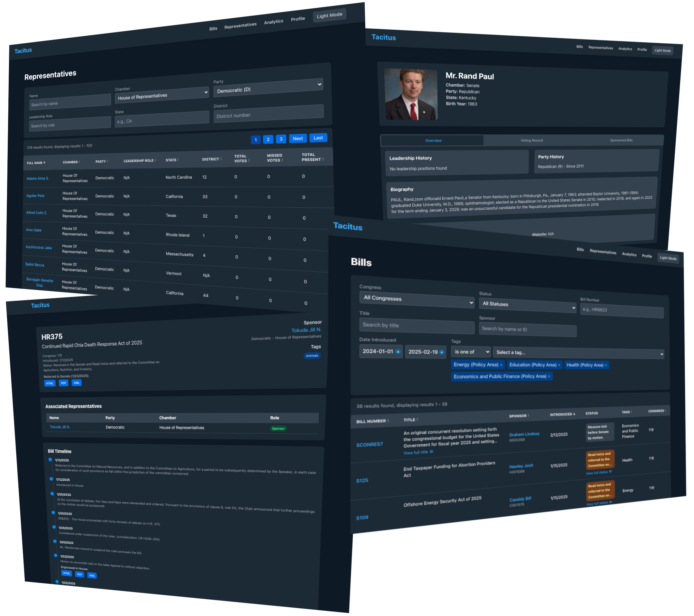

# Project Tacitus

Project Tacitus is a comprehensive platform designed to provide users with access to legislative data, voting records, and representative information. By leveraging data from various government sources and applying advanced processing techniques, it aims to make legislative information more accessible and understandable to citizens.



## Project Structure

```
project-tacitus/
├── backend/
│   └── src/
│       ├── api/                    # API routes
│       │   ├── init.py         # API blueprint initialization
│       │   ├── analytics.py        # Analytics endpoints
│       │   ├── bills.py           # Bill-related endpoints
│       │   ├── representatives.py  # Representative endpoints
│       │   └── tags.py            # Tag system endpoints
│       ├── models/                 # Data models
│       │   ├── init.py         # Model exports
│       │   ├── analytics.py        # Analytics queries
│       │   ├── bill.py            # Bill-related queries
│       │   ├── representative.py   # Representative queries
│       │   └── tag.py             # Tag system queries
│       ├── utils/                  # Utility functions
│       │   ├── init.py         # Utility exports
│       │   ├── database.py        # Database connection handling
│       │   ├── exceptions.py      # Custom exceptions
│       │   └── helpers.py         # Helper functions
│       ├── python/
│       │   └── congressgov/
│       │       ├── utils/          # Shared utilities
│       │       │   ├── init.py # Utility exports
│       │       │   ├── api.py      # API client with retry logic
│       │       │   ├── bill_utils.py # Bill-specific utilities
│       │       │   ├── database.py # Database connection handling
│       │       │   ├── file_storage.py # File operations
│       │       │   ├── logging_config.py # Logging setup
│       │       │   ├── member_utils.py # Member-specific utilities
│       │       │   └── tag_utils.py # Tag system utilities
│       │       ├── bill_fetch/     # Bill fetching and processing
│       │       │   ├── bill_fetch_core.py # Main bill fetching
│       │       │   ├── bill_detail_processor.py # Bill detail processing
│       │       │   ├── bill_batch_processor.py # Batch processing
│       │       │   ├── bill_validation.py # Validation and reporting
│       │       │   └── params_bill_fetch.py # TEMP TESTING Parameterized fetching
│       │       ├── bill_summary/   # AI-powered bill summarization
│       │       └── members_fetch/  # Representative data fetching
│       │           ├── member_fetch_core.py # Main member fetching
│       │           ├── member_detail_processor.py # Detail processing
│       │           ├── member_enrichment.py # Legislation association
│       │           ├── member_batch_processor.py # Batch processing
│       │           └── member_bio.py # Biographical information scraping
│       ├── app.py                  # Application setup
│       └── schema.sql             # Database schema
├── Docs/
│   ├── 1_Project_Overview/         # Project vision and goals
│   ├── 2_Technical_Documentation/  # Implementation details
│   │   ├── Bill_Processing_Guide.md # Bill processing documentation
│   │   └── Member_Processing_Guide.md # Member processing documentation
│   ├── 3_API_Documentation/        # API endpoints and usage
│   └── 4_Deployment_Guides/        # Setup and deployment guides
└── frontend/
└── src/
├── components/             # React components
├── pages/                  # Page layouts
└── styles/                 # CSS styles
```

## Features

### Current Functionality
- Automated bill data fetching and enrichment
- Member data collection and updates
- Representatives viewing and filtering
  - Name search
  - Chamber filter
  - Party filter
  - Leadership role filter
  - State/district filters
  - Tag filtering
- Dark mode support
- Real-time data processing
- Comprehensive error handling and logging

### In Development
- Enhanced bill analysis
- Additional data visualizations
- Advanced search capabilities
- User authentication system

### Planned Features
- Analytics dashboard with voting pattern analysis
- Full-text bill search with advanced filtering
- Customizable user dashboards
- Machine learning integration for predictive analytics

## Technology Stack

### Backend
- **Language**: Python
- **Framework**: Flask API
- **Database**: PostgreSQL
  - Structured tables for bills, members, votes, committees, hierarchical tag table structure
  - Version control for bill texts and actions
  - Relationship tracking between entities
- **External Integration**: Congress.gov API
- **Data Processing**: AI/LLM for bill summarization

### Frontend
- **Framework**: React
- **Styling**: Tailwind CSS
- **Features**: 
  - Dark mode support
  - Responsive design
  - Real-time data filtering
  - Loading states and error handling
- **State Management**: React Hooks (useState, useEffect)

## Prerequisites

- Python 3.8 or higher
- PostgreSQL
- Node.js and npm
- Git

## Getting Started

1. **Database Setup**
```bash
brew install postgresql
brew services start postgresql
createdb project_tacitus_test
psql -d project_tacitus_test -f backend/src/schema.sql
```

2. **Environment Setup**
Create a `.env` file in the project backend,
```bash
touch backend/.env
```
See [Example .env](Docs/2_Technical_Documentation/example-env) for template.

Note: You'll need to register for an API key at api.congress.gov to use this application.

3. **Backend Setup**
```bash
cd backend
python3 -m venv venv
source venv/bin/activate
pip install -r requirements.txt
python3 src/app.py
```

4. **Frontend Setup**
```bash
cd frontend
npm install
npm start
```

The frontend should now be accessible at `http://localhost:3000`.

5. **Database Check**
```bash
psql postgresql://localhost/project_tacitus_test -c "SELECT COUNT(*) FROM bills;"
```

6. **Data Fetching**

See:

a. [Bill Processing Guide](Docs/4_Deployment_Guides/Bill_Processing_Guide.md)

b. [Member Processing Guide](Docs/4_Deployment_Guides/Member_Processing_Guide.md)

**Simple Description:**
How the Files Work Together

bill_fetch_core.py - Fetches initial bill metadata
bill_detail_processor.py - Enriches bills with detailed information
bill_batch_processor.py - Processes bills in batches, useful for historical data or filling gaps
bill_validation.py - Validates database state, identifies missing information

A typical workflow might be:

Run bill_fetch_core.py to get latest bills
Run bill_detail_processor.py to enrich those bills
Run bill_validation.py to check if anything is missing
Use bill_batch_processor.py with the --validate flag to fill in any gaps

Usage Examples
1. Basic Bill Fetching (Incremental)
```bash
Python bill_fetch_core.py
```
2. Forced Full Sync
```bash
Python bill_fetch_core.py --force-full
```
3. Date Range Fetching
```bash
Python bill_fetch_core.py --start-date 2023-01-01 --end-date 2023-12-31
```
4. Process Recent Bills
```bash
Python bill_detail_processor.py --recent --limit 50
```
5. Process Specific Bill
```bash
Python bill_detail_processor.py --bill HR1234 --congress 117
```
6. Process Bills Missing Text Versions
```bash
Python bill_batch_processor.py --missing text_versions --limit 100
```
7. Process All Bills from a Congress
```bash
Python bill_batch_processor.py --congress 117 --batch-size 20 --parallel
```
8. Validate and Process Missing Data
```bash
Python bill_batch_processor.py --validate --limit 100
```

## API Structure

The backend uses a modular API structure organized into distinct layers:

- **API Routes** (`/api`): HTTP endpoint definitions and request handling
- **Models** (`/models`): Database queries and data manipulation logic
- **Utils** (`/utils`): Shared utilities, database connection, and helper functions

This separation of concerns makes the codebase more maintainable and easier to test.

## Documentation

Additional documentation is available in the `Docs` directory:

- `1_Project_Overview/`: Project vision and goals
- `2_Technical_Documentation/`: Implementation details and architecture
- `3_API_Documentation/`: API endpoints and usage guides for development
- `4_Deployment_Guides/`: Setup and deployment instructions

## Development and Maintenance

### Local Development Setup
- Local PostgreSQL database for data storage
- Python backend with Flask API
- React frontend for user interface
- AI-powered bill summarization capabilities

### Monitoring
- Error logging and tracking
- Performance monitoring
- API usage statistics
- Database health checks

### Regular Updates
- Data refreshes from Congress.gov
- API version management
- Database migrations
- Security patches

## Contributing

Please refer to the [CONTRIBUTING.md](CONTRIBUTING.md) file for guidelines on how to contribute to this project.

## License

This project is licensed under the MIT License - see the [LICENSE](LICENSE) file for details.
